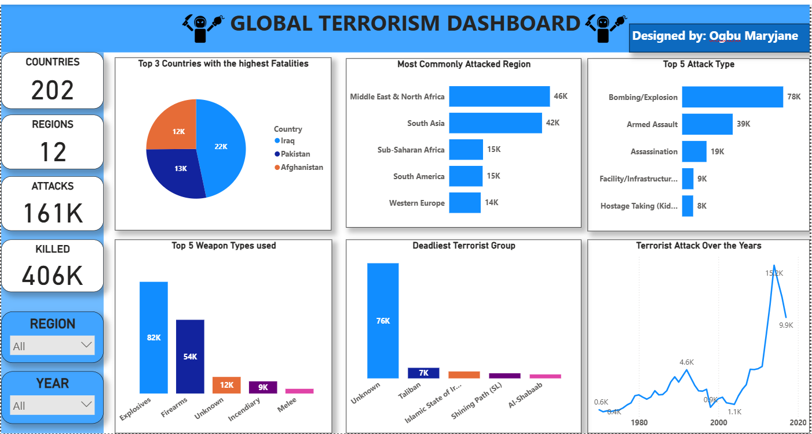
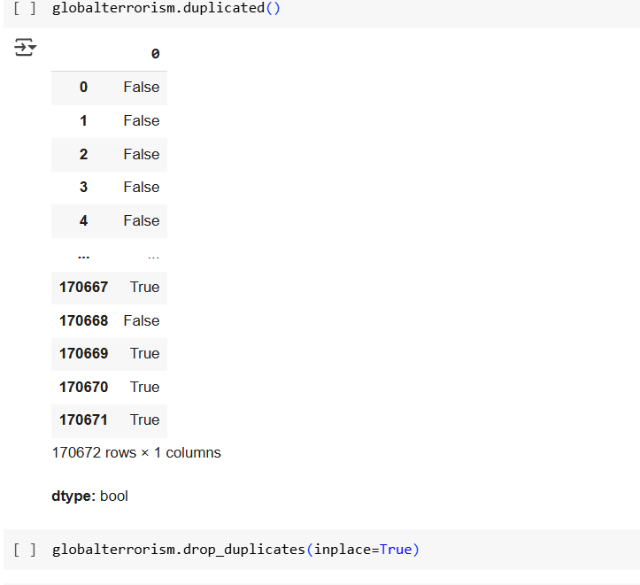
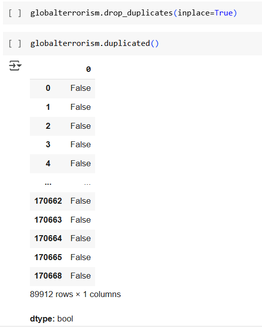

# *Global Terrorism Project*

---

## Project Overview:

This project analyzes terrorism incidents globally using a massive dataset from Kaggle.com called the Global Terrorism Database (GTD). The Global Terrorism Dataset contains information on terrorist attacks around the world from 1970 to 2017 and is currently the most comprehensive unclassified database on terrorist attacks around the world. The data includes systematic information on domestic as well as international terrorist incidents that have occurred during this time, which includes more than 180,000 attacks. 

## Data Sources:

The dataset was a CSV file downloaded from Kaggle.com, named ‘Global Terrorism Data’ from 1970-2017. The data set contains:
1.	Year: This field contains the year in which the incident occurred
2.	Country: This field identifies the country or location where the incident occurred.
3.	Region: This field identifies the region in which the incident occurred.
4.	Attack type: The general method of attack and broad class of tactics used.
5.	Weapon type: General type of weapon used in the incident
6.	Group: The name of the group that carried out the attack
7.	Killed: The number of total confirmed fatalities for the incident 
8.	Wounded: Number of wounded for the incident

## Problem Statement:

1. What are the trends of terrorist attacks over the years? (1990-2017).
2. What are the top terrorist groups in the world?
3. What are the high-risk regions in the world?
4. what types of weapons were commonly used?
5. which countries had the highest fatalities?
6. what groups of people were mostly targeted?

## Key Skills Demonstrated:

Excel and Python: data cleaning and transformation

Power BI: interactive dashboard, slicers, KPI, New Measures

## Visualization:

The Power BI dashboard was designed to be clear, interactive, and insightful. Key visuals include:

- Cards: showed number of countries attacked, number of people killed, number of regions affected.

- Bar Chart: Showed top 5 commonly attacke region, top 5 attack type

- Pie Chart: Illustrated the 3 countries with the highest confirmed fatalites
  
- Column Chart: Showed the top 5 weapon types used, the deadliest terrorist groups

### Slicers for Interactivity
 - Region Slicer: Allows users to filter insights based on Region.
 
 - Year Slicer: Enables selection of specific year to explore trends and performance over time.

You can interact with the report [here](grobalterror_project.pbix)

## Analysis:

The analysis was carried out using Python and Excel it focused on answering specific research questions related to countries with highest fatalities, regions commonly attacked, .

 **Data Cleaning & Preparation**
 
- Removed duplicates and missing values
 

- Corrected inconsistent data types

