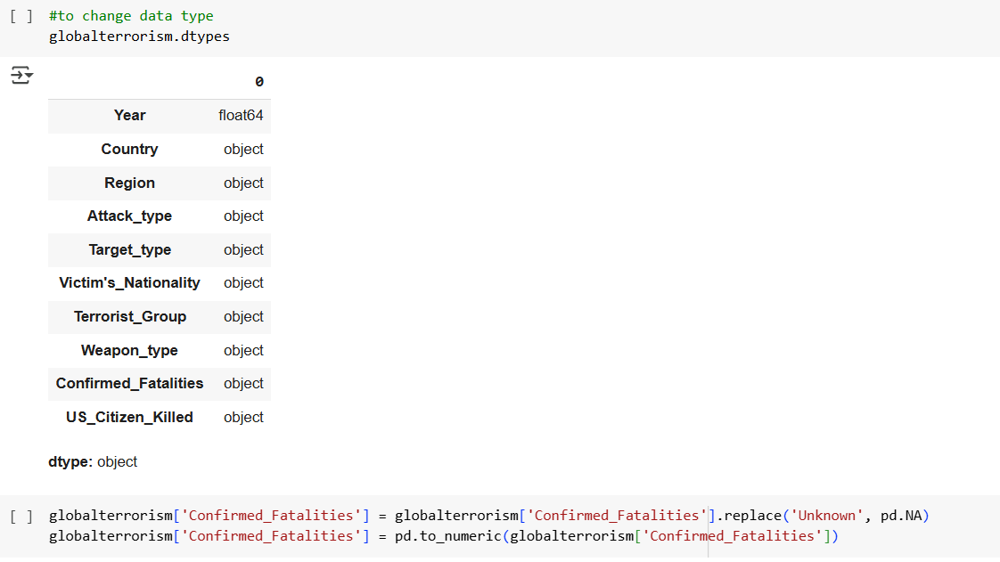
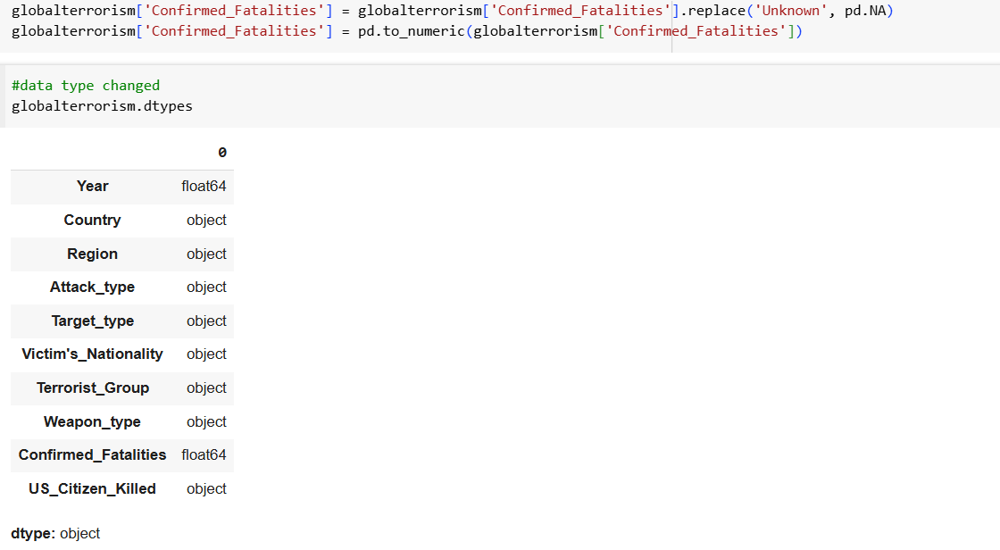
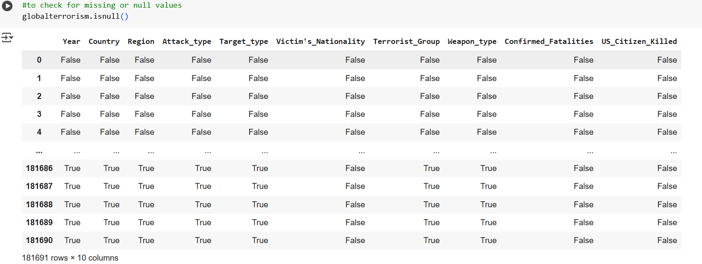
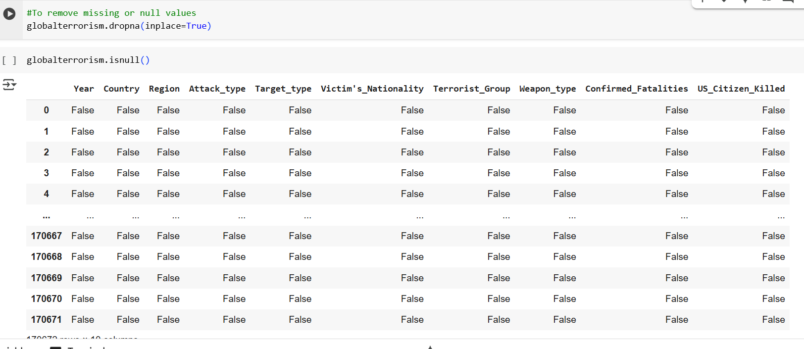

# *Global Terrorism Project*

---

## Project Overview:

This project analyzes terrorism incidents globally using a massive dataset from Kaggle.com called the Global Terrorism Database (GTD). The Global Terrorism Dataset contains information on terrorist attacks around the world from 1970 to 2017 and is currently the most comprehensive unclassified database on terrorist attacks around the world. The data includes systematic information on domestic as well as international terrorist incidents that have occurred during this time, which includes more than 180,000 attacks. 

## Data Sources:

The dataset was a CSV file downloaded from Kaggle.com, named ‘Global Terrorism Data’ from 1970-2017. The data set contains:
1.	Year: This field contains the year in which the incident occurred
2.	Country: This field identifies the country or location where the incident occurred.
3.	Region: This field identifies the region in which the incident occurred.
4.	Attack type: The general method of attack and broad class of tactics used.
5.	Weapon type: General type of weapon used in the incident
6.	Group: The name of the group that carried out the attack
7.	Killed: The number of total confirmed fatalities for the incident 
8.	Wounded: Number of wounded for the incident

## Problem Statement:

1. What are the trends of terrorist attacks over the years? (1990-2017).
2. What are the top terrorist groups in the world?
3. What are the high-risk regions in the world?
4. what types of weapons were commonly used?
5. which countries had the highest fatalities?
6. what groups of people were mostly targeted?

## Key Skills Demonstrated:

Excel and Python: data cleaning and transformation

Power BI: interactive dashboard, slicers, KPI, New Measures

## Visualization:

The Power BI dashboard was designed to be clear, interactive, and insightful. Key visuals include:

- Cards: showed number of countries attacked, number of people killed, number of regions affected.

- Bar Chart: Showed top 5 commonly attacke region, top 5 attack type

- Pie Chart: Illustrated the 3 countries with the highest confirmed fatalites
  
- Column Chart: Showed the top 5 weapon types used, the deadliest terrorist groups

### Slicers for Interactivity
 - Region Slicer: Allows users to filter insights based on Region.
 
 - Year Slicer: Enables selection of specific year to explore trends and performance over time.

You can interact with the report [here](grobalterror_project.pbix)

## Analysis:

The analysis was carried out using Python and Excel it focused on answering specific research questions related to countries with highest fatalities, regions commonly attacked, .

 **Data Cleaning & Preparation**
 
- Removed duplicates  

 <table>
  <tr>
    <th>Before: Duplicate Records Present</th>
    <th>After: Duplicates Removed</th>
  </tr>
  <tr>
    <td></td>
    <td></td>
  </tr>
</table>

- Corrected inconsistent data types

<table>
  <tr>
    <th>Before: Original Data Types</th>
    <th>After: Changed Data Types</th>
  </tr>
  <tr>
    <td></td>
    <td></td>
  </tr>
</table>

- Removed missing values

<table>
  <tr>
    <td>Before: Checking for Null</td>
    <td>After: Null Removed</td>
  </tr>
  <tr>
    <td></td>
    <td></td>
  </tr>
</table>

- Removed unnecessary columns
  

  
**Data Exploration**

- Used line graphs to explore trends of attack over time

- Created calculated measures using DAX to summarize total countries and regions affected, number of attacks.

  ## Key Findings:
  
- **Terrorist Attacks over time**: There was a significant rise in terrorist incidents from the early 2000s, the peak year being 2014 after which a gradual decline was observed.

- **Weapons Used**: Explosives and firearms are the most used weapons in the attacks. This could be as a result of these weapons being easily accessible by the terrorists.

- **Top Terrorist Groups**: The terrorist group that attacked most is unknown. However, the Taliban group,  are also responsible for a large share of attacks and fatalities.

- **Top Targeted groups**: Private citizens are the most targeted followed by Military, Police, Government and business.

- **Top Countries with highest fatalities**: Iraq, Pakistan and Afghanistan reported the highest numbers of fatalities. These could be as a result of these countries’ weak security infrastructure or active conflicts.

- **Regions affected**: The Middle East and North Africa recorded the highest number of attacks, followed by South Asia  then Sub-Saharan Africa, Western Europe being the least affected

##  Recommendation:
  
- *Strengthen Security in High-Risk Zones*: Countries with high incidents should enhance border control, and surveillance particularly in areas prone to bombings.

- *Improve Emergency Response Infrastructure*: Ensure that the affected countries have rapid medical and security response units to mitigate damage when attacks occur.

- *International Collaborations*: Countries should collaborate on data sharing, joint training and anti-terror funding since terrorism occurs across the border.

- *Control Access to Explosives and Firearms*: Laws and monitoring systems around the trade and use of these weapons should be controlled especially in known conflict zones.

## Limitations

-  The dataset does not include recent terrorist events as it covers 1970 to 2017. Periods after 2017 were not covered.

- Some entries lack the necessary details such as the number of casualties, the attack type and the group name.

- Some regions may underreport due to lack of access to the media or political sensitivity.

## Conclusion

The analysis shows the trends in global terrorism over a period close to five(5) decades. It reveals that the Middle East and South Asia were mostly affected. Explosives and firearms are the major weapons used with the private citizens as main victims. Also, an Unknown terrorist group is responsible for most of the attacks. Countries and regions highly affected should strengthen their security, control access to explosives and firearms and seek collaborations with other countries.

